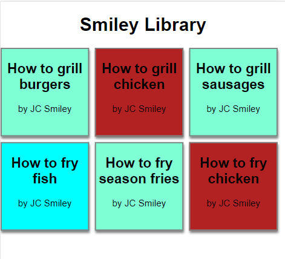

# Smiley Library

Simple app to relearn Node and React. 

### The challenge

- Build a basic React app that makes an API call to a Node backend to fetch an array of book titles.

### Built with

- Node
- Javascript functionality like the Fetch API to grab data from a JSON
- React

## Author

- Website - [JC Smiley](https://www.jcsmileyjr.com)
- Twitter - [@JCSmiley4](https://twitter.com/JCSmiley4)

